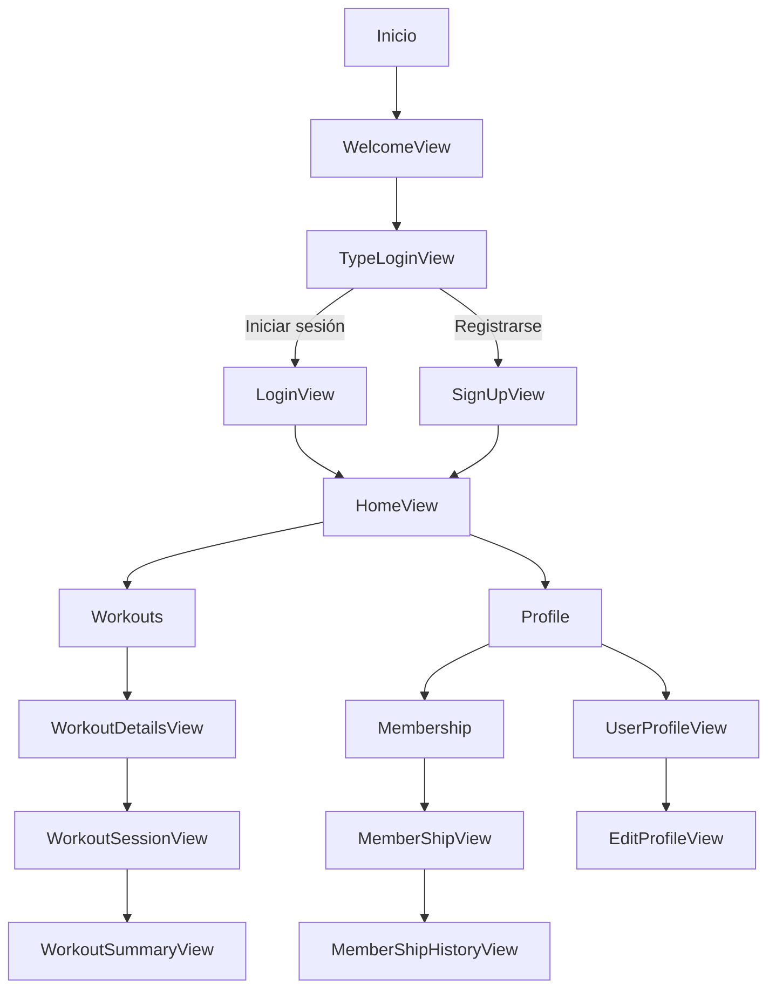

# Documentación de Features - Fitness Gym App

## Contexto del Proyecto

Esta App es una aplicación móvil desarrollada en Flutter que tiene como objetivo facilitar la gestión y seguimiento de rutinas de ejercicio, progreso físico y actividades dentro de un gimnasio. La aplicación permite a los usuarios acceder sus entrenamientos, consultar planes personalizados, monitorear su avance y acceder a información relevante sobre ejercicios y nutrición. Además, ofrece funcionalidades para administradores y entrenadores, como la gestión de usuarios, programación de clases y análisis de estadísticas.

Este proyecto busca digitalizar la experiencia en gimnasios, mejorando la interacción entre usuarios y entrenadores, y promoviendo hábitos saludables mediante el uso de tecnología móvil.

## Estrutura del proyecto

Bajo la patron MVVM el proyecto se describe en la estructura:

```
lib/
│
├── core/                        # Utilidades generales, helpers, servicios comunes
│
├── features/
│   ├── auth/                    # Feature: Autenticación (ejemplo)
│   │   ├── data/
│   │   │   ├── models/
│   │   │   ├── providers/
│   │   ├── domain/
│   │   │   ├── entities/
│   │   │   ├── repositories/
│   │   │   └── usecases/
│   │   └── ui/
│   │       └── login/
│   │           ├── view/
│   │           │   └── widgets/
│   │           └── viewmodel/  
│   │
│   ├── profile/                 # Feature: Perfil de usuario (ejemplo)
│   │   ├── data/
│   │   ├── domain/
│   │   ├── view/
│   │   └── viewmodel/
│   │
│   └── ...                      # Otros features
└── main.dart

```
---

## Diagrama de Flujo



## Resumen de Features
- WelcomeView: Pantalla de bienvenida con acceso a login o registro.
- TypeLoginView: Selección de tipo de autenticación (email, Google, etc).
- LoginView: Formulario para usuarios existentes.
- SignUpView: Formulario de registro para nuevos usuarios.
- HomeView: Pantalla principal con tabs para rutinas, nutrición y descubrimiento.
- Workouts: Listado de rutinas de ejercicios.
- WorkoutDetailsView: Detalle de una rutina seleccionada.

## Conceptos de Dart y Flutter utilizados en el proyecto

### 1. **Estructura por Features**
El proyecto está organizado por módulos o "features" (por ejemplo: `auth`, `dashboard`, `home`, `membership`, `profile`, `workouts`), siguiendo buenas prácticas de escalabilidad y mantenibilidad.

### 2. **Widgets Personalizados**
Se utilizan widgets personalizados para reutilizar componentes visuales, como:
- `AppBarCustom`
- `InputFieldCustom`
- `PrimaryElevatedButtonCustom`
- `TabsStepCustom`
Esto permite mantener un diseño consistente y facilita el mantenimiento del código.

### 3. **Gestión de Estado con Riverpod**
El proyecto utiliza [Riverpod](https://riverpod.dev/) para la gestión de estado, a través de `Provider`, `StateNotifierProvider` y `ConsumerWidget`/`ConsumerStatefulWidget`. Esto permite separar la lógica de negocio de la interfaz de usuario y facilita el testing.

### 4. **Navegación con GoRouter**
La navegación entre pantallas se gestiona con [GoRouter](https://pub.dev/packages/go_router), lo que permite rutas nombradas, navegación declarativa y paso de argumentos entre vistas.

### 5. **Internacionalización (i18n)**
El proyecto soporta múltiples idiomas usando archivos `.arb` y la librería `flutter_gen/gen_l10n`, permitiendo mostrar la app en inglés y español.

### 6. **Diseño Responsivo y Temas**
Se utilizan clases como `AppSizes`, `AppsColors` y `TextStyles` para mantener un diseño responsivo y consistente en toda la aplicación.

### 7. **Consumo de Modelos y Repositorios**
La lógica de acceso a datos está separada en modelos (`models/`) y repositorios (`repository/`), similar al patrón Repository para desacoplar la fuente de datos de la UI.

### 8. **Formularios y Validaciones**
Se implementan formularios con validaciones usando `Form`, `TextFormField` y controladores (`TextEditingController`), por ejemplo en el registro y edición de perfil.

### 9. **Componentes de UI de Flutter**
Se hace uso extensivo de componentes estándar de Flutter como `Scaffold`, `AppBar`, `ListView`, `TabBar`, `BottomNavigationBar`, entre otros.

---

Estos conceptos y patrones permiten que la aplicación sea escalable, mantenible y fácil de extender con nuevas funcionalidades.